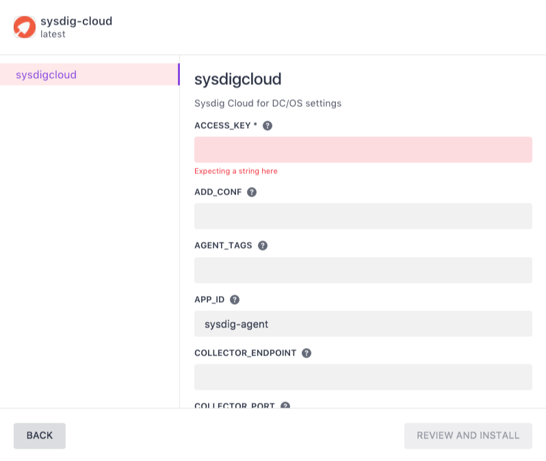

# How to use Sysdig Monitor on DC/OS

[Sysdig Monitor](https://sysdig.com/product/monitor/) is the first and only monitoring, alerting, and troubleshooting solution designed from the ground up to provide unprecedented visibility into containerized infrastructures.

DC/OS allows you to quickly deploy Sysdig Agents to an existing infrastructure.

- Estimated time for completion: 10 minutes
- Target audience: Anyone interested in monitoring containers.
- Scope: Deploy Sysdig Agents on DC/OS and monitor them with Sysdig Monitor.

## Prerequisites

- A Sysdig Cloud account for SaaS or on-premises.
- A Sysdig Agent access key.

## Deploy Sysdig Cloud

1. Log into Sysdig Monitor.
2. In the top right-hand corner, open the User dropdown menu, and select `Settings`.
3. Navigate to `Agent Installation` in the left-hand panel.
> If Agent Installation is not listed, disable the `Hide Agent Install` switch on the main `Settings` page.
4. Click the `Copy` button next to the access key.
5. Navigate to the DC/OS admin page.
6. Open the `Universe` dropdown menu on the left hand panel of the DC/OS admin page, and select `Packages`.
7. Use the search function to find and select `sysdig-cloud`.
8. Click the `Install` button.
9. Click the `Advanced Installation` link.

10. Paste the access key in the `ACCESS_KEY` text box, and define the number of required instances.
> Additional configuration parameters are required for on-premises installations. Contact the Sysdig support team for more information.
11. Once the package has been configured, click the `Review and Install` button to review the changes.
12. If the configuration is correct, click the `Install` button to complete the installation.

## Next Steps

1. Open the `Services` dropdown menu on the left-hand panel of the DC/OS admin page, and click `Services`. Click `sysdig-agent` to review the list of running agents.

2. Navigate to [https://app.sysdigcloud.com](https://app.sysdigcloud.com). The instances will now be listed on the `Explore` tab.
